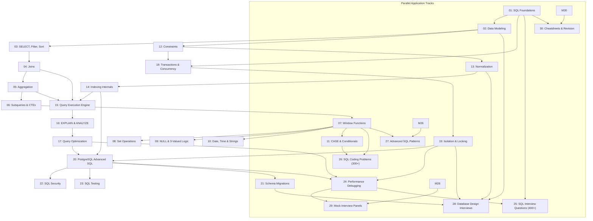

# Curriculum Dependency Graph & Learning Tracks

This document maps the architectural prerequisites, conceptual flow, and parallel learning tracks across the **30 curriculum modules**.

---

## 🗺️ Visual Progression Diagram

---

## 🧱 Core Learning Backbone

1. **Relational & Query Foundations**:
   - `01-sql-foundations` $\to$ `02-data-modeling` $\to$ `03-select-filter-sort`
   - Establishes the relational model, entity cardinality, and logical query evaluation.

2. **Multi-Table Semantics & Analytical Logic**:
   - `04-joins` $\to$ `05-aggregation` $\to$ `06-subqueries-and-cte` $\to$ `07-window-functions`
   - Covers join algorithms, row multiplication, grouping sets, framing, and recursive hierarchies.

3. **Storage, Constraints & Indexing Internals**:
   - `12-constraints` $\to$ `13-normalization` $\to$ `14-indexing`
   - Covers database-level integrity, B-Tree leaf layouts, composite ordering, and index-only scans.

4. **Execution, Diagnostics & Tuning**:
   - `15-query-execution` $\to$ `16-explain-and-explain-analyze` $\to$ `17-query-optimization`
   - Covers cost models, planner estimation skew, buffer analysis, and evidence-based rewriting.

5. **Transactions, MVCC & Concurrency**:
   - `18-transactions-and-concurrency` $\to$ `19-isolation-and-locking`
   - Covers ACID guarantees, WAL logs, snapshot isolation, deadlocks, and row locking.

6. **Production PostgreSQL Operations**:
   - `20-postgresql-sql` $\to$ `21-schema-migrations` $\to$ `22-sql-security` $\to$ `23-sql-testing` $\to$ `24-performance-debugging`
   - Covers JSONB/GIN, zero-downtime expand/contract DDL, RLS, and 40+ production incident triage runbooks.

---

## 🎯 Parallel Applied Tracks

| Track Name | Modules Involved | Ideal Start Point | Purpose |
| :--- | :--- | :--- | :--- |
| **SQL Problem Solving Track** | [26-sql-coding-problems](26-sql-coding-problems/), [27-advanced-sql-patterns](27-advanced-sql-patterns/) | After Module 07 | Practice 300+ LeetCode/HackerRank style and production queries (Gaps & Islands, Top-N). |
| **Database System Design Track** | [28-database-design-interviews](28-database-design-interviews/) | After Module 19 | Solve full architectural interview cases (E-Commerce, Banking, Booking, Subscriptions). |
| **Production Diagnostics Track** | [24-performance-debugging](24-performance-debugging/), [LABS.md](LABS.md) | After Module 19 | Triage connection spikes, autovacuum bloat, lock contention, and bad query plans. |
| **Mock Interview & Revision Track** | [25-sql-interview-questions](25-sql-interview-questions/), [29-mock-interviews](29-mock-interviews/), [30-cheatsheets-and-revision](30-cheatsheets-and-revision/) | After Module 24 | Polish verbal explanations, defend trade-offs, and conduct simulated mock panels. |
